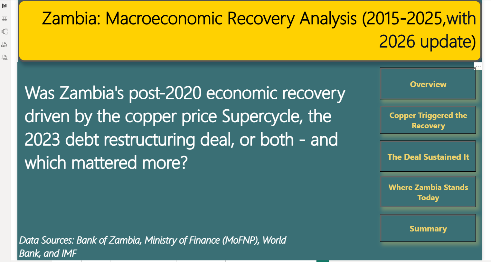
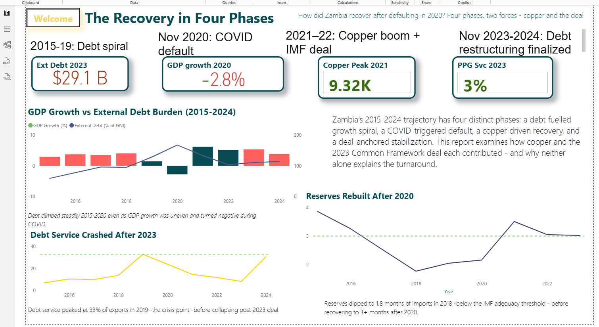
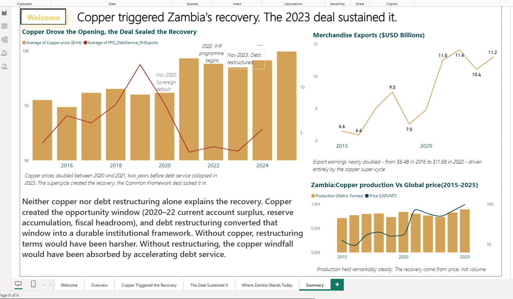

# Zambia's Macroeconomic Recovery: 2015-2025

A Power BI analytical report examining whether Zambia's post-2020 economic recovery was driven by the copper price supercycle, the 2023 G20 Common Framework debt restructuring deal, or both — and which mattered more.

## The verdict

**Copper triggered the recovery. The 2023 deal sustained it.**

## Report structure

- **Welcome** — the central question
- **Overview** — the recovery in four phases (2015-2024)
- **Copper Triggered the Recovery** — evidence for the supercycle effect
- **The Deal Sustained It** — evidence for the restructuring effect
- **Where Zambia Stands Today** — present-state indicators + risks
- **Summary** — final verdict

## Preview

### Welcome — The Central Question

### Overview — The Recovery in Four Phases

### Copper Triggered the Recovery

### The Deal Sustained It

### Where Zambia Stands Today

### Summary — The Verdict

## Key findings

- Copper price doubled 2020 → 2021 ($5.5K → $9.3K/mt)
- Current account swung from -3.6% to +11.9% of GDP, 2015 → 2021
- Mineral rents jumped from 3% to ~28% of GDP during the supercycle
- PPG debt service collapsed from 12.5% to 3% of exports, 2019 → 2023
- Eurobond restructuring completed June 2024 ($3B restructured, $840M forgiven)
- By Q1 2026, inflation back in BoZ's 6-8% target band (7.1% in March)
- BoZ has cut its policy rate three consecutive times to 13.25%
- Forward-looking risks remain: residual commercial debt, climate, copper volatility, IMF renewal

## Data sources

- Bank of Zambia (BoZ)
- Ministry of Finance and National Planning (MoFNP)
- World Bank Open Data
- International Monetary Fund (IMF)
## Documents

- **[Power BI Report](Zambia-Recovery-Analysis-2015-2025.pbix)** — full interactive analysis (requires Power BI Desktop)
- **[Executive Summary (PDF)](Zambia-Recovery-Executive-Summary.pdf)** — 3-page printable narrative
## How to open

Requires Power BI Desktop (free download from Microsoft). Open the `.pbix` file and click the page tabs at the bottom to navigate.

## Author
Boldwin Mweemba

